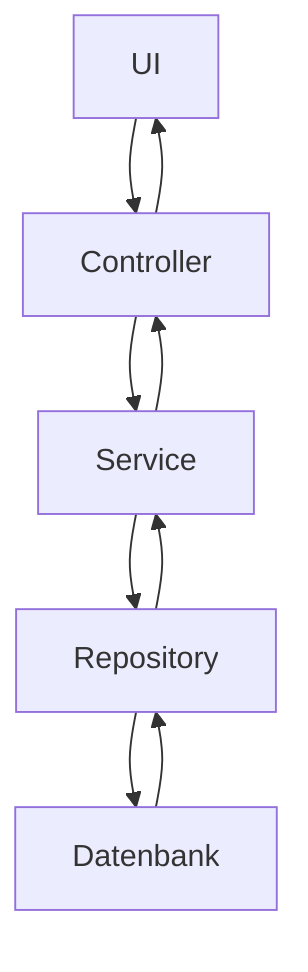

# Architektur-Dokumentation

## Überblick
Die Buchdatenbank-Anwendung ist eine datengetriebene Webanwendung, die Bücher, Autoren, Tags und Buchlisten verwaltet. Sie basiert auf einer Node.js-Backend-Architektur mit Express.js und verwendet PostgreSQL als Datenbank. Das Frontend ist modular aufgebaut und verwendet Vanilla JavaScript für die UI-Logik.

## Repository-Struktur
| Ordner/Datei                     | Zweck                                      |
|----------------------------------|--------------------------------------------|
| `server.js`                      | Einstiegspunkt der Anwendung               |
| `public/`                        | Statische Dateien und Frontend-Logik       |
| `server/`                        | Backend-Logik (Controller, Services, etc.) |
| `docs/`                          | Dokumentation                              |
| `config/`                        | Konfigurationsdateien                      |

## Entry Points & Initialisierung
- **Frontend**: `public/app.js` lädt Views und initialisiert Controller.
- **Backend**: `server.js` startet den Express-Server und bindet Routen ein.

## Seiten/Views
| View                     | Beschreibung                                |
|--------------------------|--------------------------------------------|
| `books.view.html`        | Übersicht und Verwaltung von Büchern       |
| `authors.view.html`      | Übersicht und Verwaltung von Autoren       |

## Komponenten / Wiederverwendbare UI-Bausteine
- **`view-loader.js`**: Lädt HTML-Views dynamisch.
- **`ui-helpers.js`**: Enthält generische UI-Hilfsfunktionen.

## Datenfluss

## API-Integration
| Endpoint               | Methode | Zweck                     | Genutzt in               |
|------------------------|---------|---------------------------|--------------------------|
| `/api/tags`            | GET     | Liste aller Tags          | `tags.service.js`        |
| `/api/config/apis`     | GET     | API-Status abrufen        | `config.service.js`      |

## Domänenobjekte & Beziehungen
- **Book**: Hat Titel, Autoren, Listen und Tags.
- **Author**: Hat Vor- und Nachname.
- **Tag**: Wird Büchern zugeordnet.

## Wichtige Regeln/Validierungen
- **Duplikatprüfung**: Bücher mit identischem Titel und denselben Autoren werden verhindert.
- **Transaktionen**: Änderungen an Büchern erfolgen atomar.

## Bekannte technische Schulden / Risiken
- Fehlende Tests für einige Services.
- Keine zentrale Fehlerbehandlung im Frontend.

## Offene Punkte / Annahmen
- Authentifizierung ist nicht implementiert.
- Annahme: Nur ein Nutzer greift gleichzeitig auf die Anwendung zu.